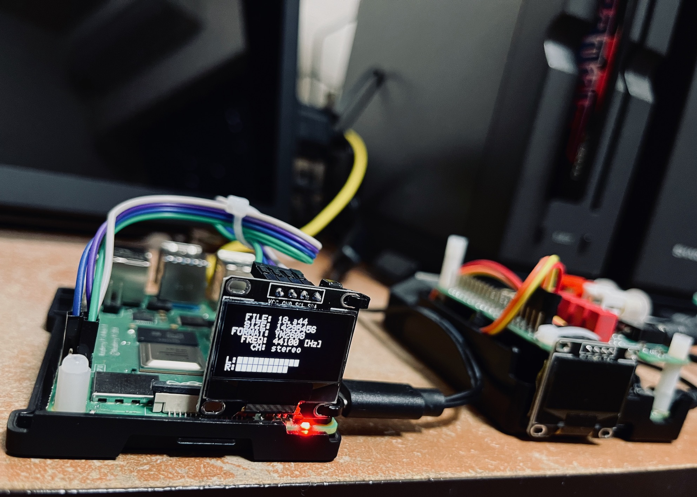

# s44rasp

X680x0 ADPCM/PCM/WAV/MCS player for Raspberry Pi with OLED support

Raspberry Pi OS 上で動作する、主にX68k向けのPCM曲データを再生するツールです。

- USB DAC 出力対応
- DAC HAT 出力対応
- OLED (SSD1306) ディスプレイ表示対応(曲情報およびレベルメータ)

以下のPCM形式をサポートしています。ファイルの拡張子で判別します。

- .s22/.s24/.s32/.s44/.s48 ... 16bit Raw PCM (big endian) stereo
- .m22/.m24/.m32/.m44/.m48 ... 16bit Raw PCM (big endian) mono
- .a22/.a24/.a32/.a44/.a48 ... YM2608 4bit-16bit ADPCM stereo
- .n22/.n24/.n32/.n44/.n48 ... YM2608 4bit-16bit ADPCM mono
- .wav ... Windows WAV 16bit Raw PCM (little endian) stereo/mono
- .pcm ... X680x0 4bit-12bit ADPCM (15.6kHz/mono)
- .mcs ... X680x0 MACS animation data (16bit PCM only)

48kHzより上の周波数のデータには対応していません。15.6kHzから32kHzのデータは48kHzにアップサンプリングされます。

---

## 動作確認済みモデルとOS

- Raspberry Pi 3B+
- Raspberry Pi 4B
- 32bit OS Lite (デスクトップ無し) 2023-05

それ以外では確認していません。

---

## How to Install

ソースコードをコンパイルする必要があります。

事前準備として `git` `libasound2-dev` を導入します。

        sudo apt-get install git libasound2-dev

このリポジトリを clone してビルドします。

        cd
        mkdir oss
        cd oss
        git clone https://github.com/tantanGH/s44rasp
        cd s44rasp
        cd src
        make

出来上がった `s44rasp` をパスの通ったところに置くかシンボリックリンクを張ります。

---

## How to Use

        s44rasp [options] <input-file.[pcm|sXX|mXX|aXX|nXX|wav|mcs]>

        options:
          -d hw:x,y ... ALSA出力デバイス名の指定 (hw:0,0 など)
          -o ... OLED出力の有効化
          -u ... 44.1kHzソースを48kHzにアップサンプリング(15.6kHz/32kHzはデフォルト有効)
          -f ... 指定デバイスでサポートされたフォーマットの一覧表示
          -h ... ヘルプメッセージの表示

出力デバイス名は `hw:0,0` のようなもので、`hw:` に続いてカード番号(デバイス名)とサブデバイス番号を入れます。
カード番号等は `aplay -l` で知ることができます。サブデバイス番号は通常0です。

---

## USB DAC の利用

ラズパイ標準のヘッドフォンジャックからの音声出力は簡易的なPWM出力なのでとても音質が悪く、音楽を聴くための設計にはなっていません。

もし手元にPC用の USB DAC、あるいはスマホ用の USB - ヘッドフォンケーブルなどがあれば、それをラズパイに挿して、D/A変換を USB DAC に委ねることで音質の劇的な改善が期待できます。

自分は ONKYO の DAC-HA200 を使っています(既に廃盤)。

[ONKYO DAC-HA200](https://www.jp.onkyo.com/audiovisual/headphone/dacha200/)

音質もさることながら、ボリュームノブの操作感が良く、あまりに気に入ったので2台持ってますw

s44rasp でこの種の USB-DAC を利用するには、USB端子にDACを接続した後、`aplay -l`で確認します。

        $ aplay -l

        **** List of PLAYBACK Hardware Devices ****
        card 0: Headphones [bcm2835 Headphones], device 0: bcm2835 Headphones [bcm2835 Headphones]
          Subdevices: 8/8
          Subdevice #0: subdevice #0
          Subdevice #1: subdevice #1
          Subdevice #2: subdevice #2
          Subdevice #3: subdevice #3
          Subdevice #4: subdevice #4
          Subdevice #5: subdevice #5
          Subdevice #6: subdevice #6
          Subdevice #7: subdevice #7
        card 1: DACHA200 [DAC-HA200], device 0: USB Audio [USB Audio]
          Subdevices: 1/1
          Subdevice #0: subdevice #0
        card 2: vc4hdmi [vc4-hdmi], device 0: MAI PCM i2s-hifi-0 [MAI PCM i2s-hifi-0]
          Subdevices: 1/1
          Subdevice #0: subdevice #0

この場合は card 1 として認識されていますので、s44rasp で利用するには以下のように指定すればok。

        s44rasp -d hw:1,0 hogehoge.s44

または

        s44rasp -d hw:DACHA200,0 hogehoge.s44

と指定します。カード番号は認識順に決まり、たまに入れ替わったりするので、デバイス名を指定することをお勧めします。

---

## Hi-Fi DAC HAT の利用

Raspberry Pi の 40pin GPIO コネクタにポン付けできる DAC HAT が数多く市販されています。特に TI PCM51xx チップを使ったものは定番です。
数千円の出費でラズパイの出力音質を劇的に向上させることが可能な上、ラズパイと一体化できて場所もとらずお勧めです。自分は InnoMaker 製のものを使っています。

[InnoMaker Hi-Fi DAC CAP](https://www.amazon.co.jp/dp/B07TFHNPCB/)

これを ALSA から利用するためには Raspberry Pi OS の`/boot/config.txt`を次のように変更する必要があります。

        sudo vi /boot/config.txt

以下の行のコメントを外し、I2Sを有効にする。

        dtparam=i2s=on

以下の行をコメントアウトし、デフォルトのPWMオーディオ出力を無効にする。

        #dtparam=audio=on

以下の行を追加し、PCM51xx用のドライバを追加する。

        dtoverlay=hifiberry-dac

再起動し、`aplay -l`で DAC HAT が認識されていることを確認する。

        $ aplay -l

        **** List of PLAYBACK Hardware Devices ****
        card 0: sndrpihifiberry [snd_rpi_hifiberry_dac], device 0: HifiBerry DAC HiFi pcm5102a-hifi-0 [HifiBerry DAC HiFi pcm5102a-hifi-0]
          Subdevices: 0/1
          Subdevice #0: subdevice #0
        card 1: DACHA200 [DAC-HA200], device 0: USB Audio [USB Audio]
          Subdevices: 1/1
          Subdevice #0: subdevice #0
        card 2: vc4hdmi [vc4-hdmi], device 0: MAI PCM i2s-hifi-0 [MAI PCM i2s-hifi-0]
          Subdevices: 1/1
          Subdevice #0: subdevice #0        

この場合 card 0 として認識されているので、s44rasp で利用するには以下のように指定すればok。

        s44rasp -d hw:0,0 hogehoge.s48

もしくは特にdefaultの出力先をALSAに登録していなければ、指定なしでもok

        s44rasp hogehoge.s48

注意：DACおよびデバイスドライバによっては44.1kHz/16bitの再生をサポートしていないことがあります。その場合は48kHzにアップサンプリング(`-u`)するなど変換が必要になりますが、若干音質が低下する恐れがあります。

        s44rasp -u hogehoge.s44

44.1kHz/24bitであればサポートしているケースもあるようですので、いずれは24bitモードも検討しています。

`-f` オプションをつけて s44rasp を起動すると、対象のデバイスでどのフォーマットが扱えるかの一覧を表示することができます。

---

## OLED (SSD1306) の利用

Raspberry Pi に接続可能な OLED ディスプレイは数多く市販されていますが、特に SSD1306コントローラを使ったものは入手性も良く、値段も数百円ですのでお勧めです。

[白色 OLEDディスプレイ 128 x 64 0.96インチ SSD1306 I2C接続モジュール](https://www.amazon.co.jp/dp/B07S81LC8V/)

自分はこの白色タイプを使っています。

s44rasp は標準で SSD1306コントローラを使ったOLEDディスプレイへの表示に対応しています。ただしI2C接続で解像度128x64のみです。

OS標準のドライバ(i2c-dev)を使うので、追加で必要となるソフトウェアはありませんが、`raspi-config` で I2C通信を有効にしておく必要があります。

また、`/boot/config.txt` に以下の行を追加して通信速度を400kbpsに設定しておくことを強くお勧めします。

        dtparam=i2c_baudrate=400000

OLED表示を行う場合は `-o` オプションをつけて実行してください。

        s44rasp -o -d hw:0,0 hogehoge.s44

https://github.com/tantanGH/s44rasp/assets/121137457/5f559c0e-38c9-4ff0-af5c-054fc20e795a

---

## Raspberry Pi のアンダークロック

特に Raspberry Pi 4B は高スペックな分、発熱量も大きいです。`s44rasp` は大してCPUを使いませんのでアンダークロック動作させても大丈夫です。

例えば `/boot/config.txt` に以下を追記することで CPUクロック上限を300MHzにすることができます。

        arm_freq=300
        over_voltage=-4

今どのクロックで動いているかを知るには `cpufreq-info` コマンドが便利です。入っていない場合は以下で導入できます。(最後のアスタリスクを忘れずに)

        sudo apt install cpufreq*

---

## Special Thanks

- .a44形式(YM2608)のデコードについては、X68kでの標準ライブラリである Otankonas氏のライブラリと完全互換とするため、氏のadpcmlibライブラリの生成した変換テーブルをそのまま使わせてもらう形での実装としています。

- OLEDに表示する 6x8サイズのフォントとして、門真なむ氏のk6x8フォントデータをコンバートしたものを利用させて頂いています。

[6×8 ドット日本語フォント「k6x8」](https://littlelimit.net/k6x8.htm)

各位にこの場を借りてお礼申し上げます。

---

## 変更履歴

- 0.4.0 (2023/07/10) ... 16/22/24kHz raw, .mcs 対応
- 0.3.2 (2023/06/03) ... -Wall で警告が出ないように調整
- 0.3.1 (2023/06/01) ... DOC更新・微調整
- 0.3.0 (2023/05/28) ... 初版
